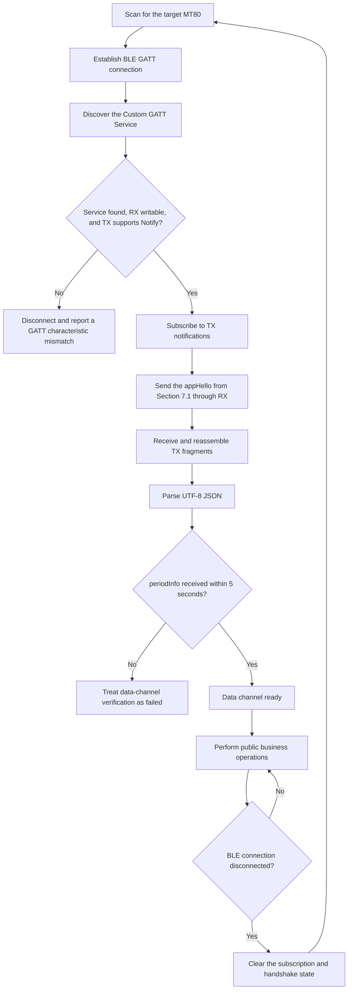

# MT80 BLE GATT SDK for Third-Party Development

[简体中文](README.zh-CN.md) | **English**

    

- Published by: DGSSL BOOKOO TECH LTD. (东莞松山湖不苦科技有限公司)
- Contact: develop@bookoocoffee.com
- Last updated: September 2, 2026
- Minimum compatible firmware: `v1.2.19.0820` (`releaseVer = 102190820`)

This directory provides the public MT80 BLE Custom GATT protocol and a minimal Python client example for third-party development on Windows 10/11.

> [!IMPORTANT]
> **Supported environment**
>
> The current example supports Windows 10/11 and Python 3.10 or later only. The ESP32 SDK example project is still under development.
>
> **This SDK does not provide an OTA (device update) control interface.**

> [!WARNING]
> **Security notice**
>
> The Custom GATT channel does not require BLE pairing, link encryption, or additional application authentication. The client should verify the device name and MAC address to ensure that it connects to the intended device.
>
> **Do not transmit passwords, tokens, or other sensitive information over this channel.**

## 1. SDK Contents and Scope

This directory contains:

|File|Purpose|
|---|---|
|`README.en.md`|English integration guide and public protocol reference|
|`mt80_gatt_client.py`|Minimal GATT connection, fragmentation, handshake, and broadcast observation example|
|`requirements.txt`|Python dependency, currently pinned to `bleak==3.0.2`|

Public capabilities include:

- Explicit application-layer handshake;
- One-time broadcast and 5 Hz periodic broadcast after connection;
- General settings;
- Reading and setting the complete grinding-section configuration;
- Importing, exporting, adding, deleting, listing deleted items, restoring, editing, reordering, and reading grinding statistics for user presets;
- Common error responses for the operations above.

The Python example implements only the minimal protocol stack needed to verify the data channel. It does not wrap every business operation. Implement business requests by following the JSON, fragmentation, and GATT write rules in this document.

## 2. Features Under Development

The capabilities in this section are not included in the current SDK. The following information describes the development direction; the official release determines the actual schedule, interface, and availability.

### 2.1 BLE Grinding Start/Stop Control

**Current status: under safety evaluation.**

The current version does not provide an interface for remotely starting or stopping grinding over BLE.

We will fully evaluate operational safety, abnormal-state handling, and safeguards against unintended activation in real-world use. We may make this interface public in a future release after confirming that sufficient safety measures are in place.

### 2.2 High-Frequency Sensor Data Broadcast

**Planned status: next firmware update.**

To support developers building automatic control for motorized grind-size adjustment, we plan to add a dedicated high-frequency sensor data broadcast.

- Target broadcast frequency: **10–20 Hz**;
- Primary purpose: provide higher-frequency sensor feedback for automatic control of motorized grind-size adjustment mechanisms.

The official release determines the final interface, data fields, and actual broadcast frequency.

## 3. Windows Python Quick Start

### 3.1 Requirements

- Windows 10 or Windows 11;
- A working Bluetooth Low Energy adapter;
- Python 3.10 or later;
- MT80 firmware `v1.2.19.0820` or later.

The current example has been verified with Python 3.14.6.

### 3.2 Installation and Usage

Run the following commands in this directory:

```shell
python -m pip install -r requirements.txt
python mt80_gatt_client.py <MAC>
```

Example:

```shell
python mt80_gatt_client.py 10:20:30:40:50:60
```

The script will:

1. Scan for the specified public MAC address for up to 10 seconds;
2. Connect to the device and discover the Custom GATT Service;
3. Subscribe to TX notifications;
4. Automatically send the explicit application-layer handshake;
5. Reassemble and parse the received UTF-8 JSON;
6. Wait up to 5 seconds for the first `broadcast.periodInfo` message and treat its receipt as successful data-channel verification;
7. Continue displaying other messages and update `periodInfo` in place in an interactive terminal.

The terminal should support ANSI cursor control and be wide enough to prevent a single JSON line from wrapping automatically. When output is redirected or the terminal is non-interactive, the script automatically falls back to block-by-block output. Press `Ctrl+C` to exit and disconnect.

## 4. BLE Discovery and Custom GATT Service

### 4.1 Device Discovery

- The device name follows the format `BOOKOO MT80 xxxxxxxx`, where `xxxxxxxx` is an eight-digit hexadecimal suffix.
- The device uses a BLE public address. Use the MAC address returned by scanning when connecting.
- The Custom Service UUID is not included in BLE Advertising data. First locate the device by name or MAC address, then perform GATT Service Discovery after connecting.

In this document, a “periodic broadcast” is an application-layer message sent through GATT Notify during a connected session. It is not BLE Advertising sent while disconnected.

### 4.2 UUIDs and Properties

|Purpose|UUID|Properties|
|---|---|---|
|Custom Service|`4d543830-0001-4b80-8f00-424f4f4b4f4f`|Primary Service|
|RX (client → device)|`4d543830-0002-4b80-8f00-424f4f4b4f4f`|Write, Write Without Response|
|TX (device → client)|`4d543830-0003-4b80-8f00-424f4f4b4f4f`|Notify|

Write with Response is recommended for sending RX fragments in sequence. When using Write Without Response, the client must still preserve fragment order and observe platform flow control.

### 4.3 Connection Sequence



Every BLE disconnection invalidates the current subscription and handshake state. **After reconnecting, subscribe to TX again and resend `appHello`.**

## 5. GATT Fragment Frame v1

Each RX Write or TX Notify carries one fragment. The frame header is fixed at 8 bytes, and all multibyte integers use little-endian byte order.

|Offset|Length|Field|Description|
|---:|---:|---|---|
|0|1|`magic`|Fixed at `0xA5`|
|1|1|`version`|Fixed at `0x01`|
|2|2|`sequence`|Must be identical for every fragment of the same logical JSON message|
|4|2|`totalLength`|Byte length of the complete UTF-8 JSON, in the range `1..4096`|
|6|2|`offset`|Byte offset of this fragment's payload within the complete JSON|
|8|N|`payload`|UTF-8 JSON byte fragment|

### 5.1 Fragmentation and Reassembly Rules

- The first fragment must have `offset` set to `0`.
- Each subsequent fragment's `offset` must exactly equal the total number of payload bytes already received.
- Reassembly is complete when `offset + current payload length == totalLength`.
- The receiver reassembles only one message at a time. A new fragment with `offset = 0` starts a new message and replaces any incomplete message.
- An incomplete message expires when the interval between adjacent fragments exceeds 2 seconds.
- The complete fragment packet length must not exceed `min(negotiated ATT MTU - 3, 512)` bytes.
- The Python example uses fixed 20-byte complete fragment packets. Each fragment therefore carries at most 12 bytes of JSON payload and remains compatible with the default ATT MTU of 23.

`sequence` is used only to confirm that fragments belong to the same logical message. It is a `uint16` and is not guaranteed to be consecutive across messages. A client must not use it to infer message loss or business ordering, or to correlate a request with a response. The sender may reuse a valid sequence number for a new message.

### 5.2 Logical Message Encoding

Encode business JSON as UTF-8 before fragmentation. Compact JSON without unnecessary whitespace is recommended on the wire, for example:

```text
{"request":{"appHello":{"op":"handshake"}}}
```

All field-length limits are measured in UTF-8 bytes, not Unicode characters.

## 6. JSON Message Model

### 6.1 Top-Level Message Types

|Top-level field|Direction|Description|
|---|---|---|
|`request`|Client → device|Business request initiated by the client|
|`response`|Device → client|Successful or failed result of a request|
|`broadcast`|Device → client|One-time or periodic data sent by the device|

Composition rules:

- A `request` node may contain only one business object, such as one of `appHello`, `geneSetting`, `grindSection`, or `grindPreset`.
- A `broadcast` node may contain multiple business objects at the same time. For example, the first message may contain both `baseInfo` and `periodInfo`.
- If a request contains multiple business objects, the device returns a failure response and does not apply the request.

### 6.2 Success Response

A success response appears under the same business object as the request:

```json
{
  "response": {
    "geneSetting": {
      "result": "success",
      "data": {
        "cupDetect": true
      }
    }
  }
}
```

### 6.3 Failure Response

```json
{
  "response": {
    "geneSetting": {
      "result": "fail",
      "error": {
        "code": "OUT_OF_RANGE",
        "message": "feedingRpm out of range",
        "field": "feedingRpm"
      }
    }
  }
}
```

Only the first detected error is returned for a request, and the entire request is rejected. `error.field` appears only when the error can be associated with a specific field.

## 7. Handshake and Device Broadcasts

### 7.1 Explicit Application-Layer Handshake

This handshake is not BLE pairing or an encryption handshake. After subscribing to TX notifications, the client must send:

```json
{
  "request": {
    "appHello": {
      "op": "handshake"
    }
  }
}
```

The handshake has no direct response. After receiving it, the device sends `baseInfo` once and begins sending `periodInfo` at **5 Hz (approximately once every 200 ms)**. The Python example treats receipt of the first `periodInfo` within 5 seconds as successful connection and data-channel verification.

### 7.2 One-Time Post-Connection Broadcast: `baseInfo`

Sent once after the handshake in each connection session.

|Field|Type|Meaning and constraints|
|---|---|---|
|`releaseVer`|int|Current device release version; for example, `102040416` represents `v1.2.4.0416`|
|`snCode`|string|Device serial number, up to 32 UTF-8 bytes|
|`wifiName`|string or null|Name of the connected Wi-Fi network, up to 32 UTF-8 bytes; JSON `null` when disconnected|

```json
{
  "broadcast": {
    "baseInfo": {
      "releaseVer": 102040416,
      "snCode": "SN0000000MT12355",
      "wifiName": "BK-WIFI"
    }
  }
}
```

### 7.3 Periodic Broadcast: `periodInfo`

After the handshake, the device sends this message at 5 Hz while the BLE connection remains active.

|Field|Type|Meaning and constraints|
|---|---|---|
|`feedingRpm`|int|Bean-feeding speed in rpm|
|`bladeGap`|int|Grind size/burr gap in μm|
|`grindRpm`|int|Grinding speed in rpm|
|`humidity`|int|Relative humidity in %|
|`devState`|string|Device operating state; see Section [7.3.1](#731-devstate)|
|`netState`|string|Wi-Fi network state; see Section [7.3.2](#732-netstate)|
|`totalGrinds`|int|Device lifetime grind count|
|`cupDetect`|bool|Whether cup detection is enabled|
|`autoStop`|bool|Whether automatic grinding stop is enabled|
|`fastClean`|bool|Whether accelerated residual-ground clearing is enabled|
|`brightness`|int|Backlight brightness, range `[1, 5]`|
|`standbySec`|int|Sleep timeout in seconds, range `[60, 900]`|
|`selectPreset`|int|Current mode; `-1` means N mode and `[0, 9]` is the user-preset index|

```json
{
  "broadcast": {
    "periodInfo": {
      "feedingRpm": 65,
      "bladeGap": 500,
      "grindRpm": 700,
      "humidity": 25,
      "devState": "IDLE",
      "netState": "CONNECTED",
      "totalGrinds": 120,
      "cupDetect": true,
      "autoStop": true,
      "fastClean": true,
      "brightness": 5,
      "standbySec": 60,
      "selectPreset": -1
    }
  }
}
```

#### 7.3.1 `devState`

The following values are stable public enumeration values:

|Value|Meaning|
|---|---|
|`IDLE`|Idle|
|`GRINDING`|Grinding|
|`SETTING`|Applying settings|
|`UPDATING`|Device update in progress|
|`WARNING`|Warning state|
|`HighSpeedClean`|High-speed residual-ground clearing|
|`BootGuide`|Startup guide in progress|
|`UNKNOWN`|Unknown state|

The client must tolerate non-empty strings not listed in the table and treat them as unknown states. An unknown value must not cause disconnection or failure to parse the entire `periodInfo` message.

> [!IMPORTANT]
>
> The inconsistent capitalization of the public enumeration values will be corrected in the next firmware update. Please take particular note that the `devState` value table will change in the upcoming update.

#### 7.3.2 `netState`

|Value|Meaning|
|---|---|
|`CONNECTED`|Wi-Fi connected|
|`DISCONNECTED`|Wi-Fi disconnected|

## 8. General Settings: `geneSetting`

### 8.1 Field Definitions

|Field|Type|Meaning and setting range|
|---|---|---|
|`feedingRpm`|int|Bean-feeding speed in rpm, range `[10, 65]`|
|`bladeGap`|int|Burr gap in μm, range `[0, 999]`|
|`grindRpm`|int|Grinding speed in rpm, range `[500, 1500]`|
|`cupDetect`|bool|Cup detection|
|`brightness`|int|Backlight brightness, range `[1, 5]`|
|`standbySec`|int|Sleep timeout in seconds, range `[60, 900]`|
|`selectPreset`|int|`-1` means N mode; `[0, 9]` is the user-preset index|
|`autoStop`|bool|Automatic grinding stop|
|`fastClean`|bool|Accelerated residual-ground clearing|

Both reads and writes require an explicit client request. Receipt of the corresponding response marks completion of that business operation.

### 8.2 Read Selected Fields

Set `selector.type` to `keys`; `value` is an array of field names to read.

```json
{
  "request": {
    "geneSetting": {
      "op": "get",
      "selector": {
        "type": "keys",
        "value": ["cupDetect"]
      }
    }
  }
}
```

```json
{
  "response": {
    "geneSetting": {
      "result": "success",
      "data": {
        "cupDetect": true
      }
    }
  }
}
```

### 8.3 Read All Fields

```json
{
  "request": {
    "geneSetting": {
      "op": "get",
      "selector": {
        "type": "all"
      }
    }
  }
}
```

```json
{
  "response": {
    "geneSetting": {
      "result": "success",
      "data": {
        "feedingRpm": 65,
        "bladeGap": 500,
        "grindRpm": 700,
        "cupDetect": true,
        "brightness": 5,
        "standbySec": 300,
        "selectPreset": -1,
        "autoStop": true,
        "fastClean": true
      }
    }
  }
}
```

### 8.4 Set One Field

```json
{
  "request": {
    "geneSetting": {
      "op": "set",
      "data": {
        "feedingRpm": 65
      }
    }
  }
}
```

```json
{
  "response": {
    "geneSetting": {
      "result": "success",
      "data": {
        "feedingRpm": 65
      }
    }
  }
}
```

### 8.5 Set Multiple Fields

```json
{
  "request": {
    "geneSetting": {
      "op": "set",
      "data": {
        "feedingRpm": 65,
        "bladeGap": 500,
        "grindRpm": 700,
        "cupDetect": true,
        "brightness": 5,
        "standbySec": 300,
        "selectPreset": 1,
        "autoStop": true,
        "fastClean": true
      }
    }
  }
}
```

```json
{
  "response": {
    "geneSetting": {
      "result": "success",
      "data": {
        "feedingRpm": 65,
        "bladeGap": 500,
        "grindRpm": 700,
        "cupDetect": true,
        "brightness": 5,
        "standbySec": 300,
        "selectPreset": 1,
        "autoStop": true,
        "fastClean": true
      }
    }
  }
}
```

## 9. Grinding Sections: `grindSection`

Up to six grinding sections are supported. The complete configuration can be read or set, but an individual section's name or range cannot be modified separately.

Each section has the following format:

|Field|Type|Meaning and constraints|
|---|---|---|
|`name`|string|Section name, up to 32 UTF-8 bytes|
|`range`|JSON array|Range containing two integers; boundaries of different sections must not overlap|

### 9.1 Read All Sections

```json
{
  "request": {
    "grindSection": {
      "op": "get",
      "selector": {"type": "all"}
    }
  }
}
```

```json
{
  "response": {
    "grindSection": {
      "result": "success",
      "data": [
        {"name": "xxxx", "range": [100, 200]},
        {"name": "yyyy", "range": [201, 400]},
        {"name": "zzzz", "range": [401, 600]}
      ]
    }
  }
}
```

### 9.2 Set All Sections

```json
{
  "request": {
    "grindSection": {
      "op": "set",
      "data": [
        {"name": "xxxx", "range": [100, 200]},
        {"name": "yyyy", "range": [201, 400]},
        {"name": "zzzz", "range": [401, 600]}
      ]
    }
  }
}
```

```json
{
  "response": {
    "grindSection": {
      "result": "success",
      "data": [
        {"name": "xxxx", "range": [100, 200]},
        {"name": "yyyy", "range": [201, 400]},
        {"name": "zzzz", "range": [401, 600]}
      ]
    }
  }
}
```

## 10. User Grinding Presets: `grindPreset`

The device can store up to 10 currently visible user presets. Preset deletion uses recycle-bin (tombstone) semantics. A deleted preset can be restored while the device still retains its tombstone.

### 10.1 Preset Fields

```json
{
  "uid": "5f2c8a0b9d6e4f31a7c2b8d4e1f6a903",
  "name": "French Press",
  "note": "",
  "bladeGap": 350,
  "feedingRpm": 55,
  "grindRpm": 600,
  "totalGrinds": 27,
  "index": 1
}
```

|Field|Type|Meaning and constraints|
|---|---|---|
|`uid`|string|Unique preset identifier; exactly 32 ASCII bytes, without hyphens, and must not be duplicated|
|`name`|string|Preset name, up to 32 UTF-8 bytes|
|`note`|string|Optional note, up to 64 UTF-8 bytes; validated only while parsing a request and neither cached nor persisted by the device|
|`bladeGap`|int|Burr gap, range `[0, 999]`|
|`feedingRpm`|int|Bean-feeding speed in rpm, range `[10, 65]`|
|`grindRpm`|int|Grinding speed in rpm, range `[500, 1500]`|
|`totalGrinds`|int|Cumulative grind count maintained by the device; the client must not set it|
|`index`|int|Current ordering index, range `[0, 9]`; values must not be duplicated within the same batch|

> [!IMPORTANT]
> **The device does not retain `note`**
>
> The device accepts `note` only for protocol compatibility and length validation. It is not written to preset storage or retained for later requests. Export and query results, as well as successful add, import, and edit responses, return `note` as an empty string (`""`). If an application needs preset notes, store them on the client and associate them with presets by `uid`.

Field ownership and general constraints:

- When adding or importing, the client provides `uid`, `index`, `name`, `bladeGap`, `feedingRpm`, and `grindRpm`. `note` is optional but is not retained by the device.
- When editing, the client may write `name`, `bladeGap`, `feedingRpm`, and `grindRpm`. A `note` may be submitted but is not retained. Use the reorder operation to change ordering.
- The client assigns and maintains `uid` and `index`; the device maintains `totalGrinds`.
- When modifying an existing preset, preserve its original UID. Do not generate a new UID when its name or parameters change.
- A duplicate `uid`, duplicate `index`, or any other invalid field causes the entire request to be rejected.

### 10.2 Export All Presets

```json
{
  "request": {
    "grindPreset": {
      "op": "get",
      "selector": {"type": "all"}
    }
  }
}
```

```json
{
  "response": {
    "grindPreset": {
      "result": "success",
      "data": [
        {
          "uid": "5f2c8a0b9d6e4f31a7c2b8d4e1f6a903",
          "name": "French Press", "note": "",
          "bladeGap": 350, "feedingRpm": 55, "grindRpm": 600,
          "totalGrinds": 27, "index": 0
        },
        {
          "uid": "7a1e4c9d2b6f45c8a0d3e7f9b2c4d615",
          "name": "Pour Over", "note": "",
          "bladeGap": 520, "feedingRpm": 48, "grindRpm": 720,
          "totalGrinds": 14, "index": 1
        }
      ]
    }
  }
}
```

### 10.3 Import All Presets

```json
{
  "request": {
    "grindPreset": {
      "op": "set",
      "data": [
        {
          "uid": "5f2c8a0b9d6e4f31a7c2b8d4e1f6a903",
          "index": 0, "name": "French Press", "note": "",
          "bladeGap": 350, "feedingRpm": 55, "grindRpm": 600
        },
        {
          "uid": "7a1e4c9d2b6f45c8a0d3e7f9b2c4d615",
          "index": 1, "name": "Pour Over", "note": "Light Roast",
          "bladeGap": 520, "feedingRpm": 48, "grindRpm": 720
        }
      ]
    }
  }
}
```

```json
{
  "response": {
    "grindPreset": {
      "result": "success",
      "data": [
        {
          "uid": "5f2c8a0b9d6e4f31a7c2b8d4e1f6a903",
          "name": "French Press", "note": "",
          "bladeGap": 350, "feedingRpm": 55, "grindRpm": 600,
          "totalGrinds": 27, "index": 0
        },
        {
          "uid": "7a1e4c9d2b6f45c8a0d3e7f9b2c4d615",
          "name": "Pour Over", "note": "",
          "bladeGap": 520, "feedingRpm": 48, "grindRpm": 720,
          "totalGrinds": 14, "index": 1
        }
      ]
    }
  }
}
```

### 10.4 Add a Preset

```json
{
  "request": {
    "grindPreset": {
      "op": "add",
      "data": {
        "uid": "3c8d5a9e1b7246f0a4d9c7e2b1f6358a",
        "index": 2, "name": "Espresso", "note": "Double Shot",
        "bladeGap": 180, "feedingRpm": 62, "grindRpm": 1100
      }
    }
  }
}
```

```json
{
  "response": {
    "grindPreset": {
      "result": "success",
      "data": {
        "uid": "3c8d5a9e1b7246f0a4d9c7e2b1f6358a",
        "name": "Espresso", "note": "",
        "bladeGap": 180, "feedingRpm": 62, "grindRpm": 1100,
        "totalGrinds": 0, "index": 2
      }
    }
  }
}
```

### 10.5 Delete a Preset

After successful deletion, the target preset is removed from the currently visible list and moved to the recycle bin. If a middle index is deleted, the device automatically decrements all higher indices and reorders the list.

```json
{
  "request": {
    "grindPreset": {
      "op": "delete",
      "selector": {
        "type": "uid",
        "value": "3c8d5a9e1b7246f0a4d9c7e2b1f6358a"
      }
    }
  }
}
```

```json
{
  "response": {
    "grindPreset": {
      "result": "success",
      "data": {
        "uid": "3c8d5a9e1b7246f0a4d9c7e2b1f6358a"
      }
    }
  }
}
```

### 10.6 Query the Recycle Bin

```json
{
  "request": {
    "grindPreset": {
      "op": "get",
      "selector": {"type": "tombstones"}
    }
  }
}
```

```json
{
  "response": {
    "grindPreset": {
      "result": "success",
      "data": [
        {
          "uid": "3c8d5a9e1b7246f0a4d9c7e2b1f6358a",
          "lastName": "Espresso",
          "deletedSeq": 12,
          "deletedUtcTime": 1719830400,
          "hasStatSlot": true
        }
      ]
    }
  }
}
```

|Field|Type|Meaning and constraints|
|---|---|---|
|`uid`|string|32-byte unique identifier of the deleted preset|
|`lastName`|string|Snapshot of the name before deletion, up to 32 UTF-8 bytes|
|`deletedSeq`|int|Device-incremented deletion sequence number used to deterministically evict the oldest deleted item|
|`deletedUtcTime`|int|UTC timestamp at deletion; `0` when the device clock is unreliable|
|`hasStatSlot`|bool|Whether the preset's statistics slot is still retained; the current value `true` means retained|

### 10.7 Restore a Deleted Preset

Set `selector.type` to `uid`. `data.index` is optional; when omitted, the preset is restored at the end of the current list.

```json
{
  "request": {
    "grindPreset": {
      "op": "restore",
      "selector": {
        "type": "uid",
        "value": "3c8d5a9e1b7246f0a4d9c7e2b1f6358a"
      },
      "data": {"index": 2}
    }
  }
}
```

```json
{
  "response": {
    "grindPreset": {
      "result": "success",
      "data": {
        "uid": "3c8d5a9e1b7246f0a4d9c7e2b1f6358a",
        "name": "Espresso", "note": "",
        "bladeGap": 180, "feedingRpm": 62, "grindRpm": 1100,
        "totalGrinds": 0, "index": 2
      }
    }
  }
}
```

Restore rules:

- If `data.index` is omitted and there are already 10 visible presets, the device returns `CONFLICT` with `message` set to `preset count exceeded` and `field` set to `data.index`.
- If the supplied `data.index` is not a valid integer index or is greater than the insertion position at the end of the current list, the device returns `INVALID_PARAM` with `message` set to `index invalid` and `field` set to `data.index`.
- If restoration succeeds but reordering fails, the device returns `INVALID_STATE` with `message` set to `reorder restored preset failed`.
- After successful restoration, the item is removed from the recycle bin and retains its existing statistics.

### 10.8 Edit a Preset

```json
{
  "request": {
    "grindPreset": {
      "op": "update",
      "selector": {
        "type": "uid",
        "value": "5f2c8a0b9d6e4f31a7c2b8d4e1f6a903"
      },
      "data": {
        "note": "Cold Brew",
        "bladeGap": 420,
        "feedingRpm": 45,
        "grindRpm": 650
      }
    }
  }
}
```

```json
{
  "response": {
    "grindPreset": {
      "result": "success",
      "data": {
        "uid": "5f2c8a0b9d6e4f31a7c2b8d4e1f6a903",
        "name": "French Press", "note": "",
        "bladeGap": 420, "feedingRpm": 45, "grindRpm": 650,
        "totalGrinds": 27, "index": 0
      }
    }
  }
}
```

### 10.9 Reorder Presets

```json
{
  "request": {
    "grindPreset": {
      "op": "reorder",
      "data": {
        "uid": "7a1e4c9d2b6f45c8a0d3e7f9b2c4d615",
        "index": 2
      }
    }
  }
}
```

```json
{
  "response": {
    "grindPreset": {
      "result": "success",
      "data": {
        "uid": "7a1e4c9d2b6f45c8a0d3e7f9b2c4d615",
        "index": 2
      }
    }
  }
}
```

### 10.10 Recommended UID Generation

The client generates the UID when creating a preset. The recommended algorithm concatenates two FNV-1a 64-bit hashes into 32 lowercase hexadecimal characters:

```text
hhhhhhhhhhhhhhhhllllllllllllllll
```

- The first 16 characters are the high 64-bit hash, and the last 16 characters are the low 64-bit hash.
- The UID is 32 ASCII bytes without hyphens. It resembles a UUID but does not follow the UUID standard.
- The C string output buffer must be at least 33 bytes to include the terminating `\0`.
- The preset name, note, and grinding parameters are not included in the calculation.

Input data and calculation steps:

1. Remove all non-hexadecimal characters from the device ID. If the result contains exactly 12 digits, convert it to six MAC bytes; otherwise, fall back to six `0x00` bytes.
2. Calculate `time_value = Unix timestamp in milliseconds + seed`, wrap it as an unsigned 64-bit value, and encode it as eight little-endian bytes.
3. Use salts `BK-GRIND-DEFAULT-H-V1` and `BK-GRIND-DEFAULT-L-V1` for the high and low 64-bit values, respectively.
4. Use the FNV-1a offset basis `14695981039346656037` and prime `1099511628211`; retain only the low 64 bits after each multiplication.
5. If both the high and low portions are all `0`, or both are all `0xFF`, XOR the low 64-bit value with `0x9E3779B97F4A7C15`.

Recommended `seed` values:

- Adding one preset: the current number of presets on the device;
- Batch import: the current preset count plus the preset's position within the batch;
- When creating multiple presets in the same millisecond, use a different `seed` for each one.

After generation, check the UID against all UIDs currently on the device. If a conflict occurs, generate another UID using a new timestamp or an unused `seed`. This UID identifies a preset only; it is not used for signing, encryption, or security authentication.

#### 10.10.1 C Reference

```c
#include <ctype.h>
#include <inttypes.h>
#include <stddef.h>
#include <stdint.h>
#include <stdio.h>
#include <string.h>

#define FNV1A64_OFFSET UINT64_C(14695981039346656037)
#define FNV1A64_PRIME  UINT64_C(1099511628211)
#define UID_PERTURB    UINT64_C(0x9E3779B97F4A7C15)

static const char UID_SALT_HIGH[] = "BK-GRIND-DEFAULT-H-V1";
static const char UID_SALT_LOW[] = "BK-GRIND-DEFAULT-L-V1";

static uint64_t fnv1a64_update(
    uint64_t hash,
    const uint8_t *data,
    size_t length
) {
    for (size_t index = 0; index < length; ++index) {
        hash ^= data[index];
        hash *= FNV1A64_PRIME;
    }
    return hash;
}

static int hex_value(char character) {
    if (character >= '0' && character <= '9') {
        return character - '0';
    }
    if (character >= 'a' && character <= 'f') {
        return character - 'a' + 10;
    }
    if (character >= 'A' && character <= 'F') {
        return character - 'A' + 10;
    }
    return -1;
}

static void resolve_mac_bytes(
    const char *device_id,
    uint8_t mac_bytes[6]
) {
    char normalized[12];
    size_t length = 0;
    int overflow = 0;

    for (size_t index = 0;
         device_id != NULL && device_id[index] != '\0';
         ++index) {
        unsigned char character = (unsigned char)device_id[index];
        if (!isxdigit(character)) {
            continue;
        }
        if (length >= sizeof(normalized)) {
            overflow = 1;
            break;
        }
        normalized[length++] = (char)character;
    }

    if (overflow || length != sizeof(normalized)) {
        memset(mac_bytes, 0, 6);
        return;
    }

    for (size_t index = 0; index < 6; ++index) {
        int high = hex_value(normalized[index * 2]);
        int low = hex_value(normalized[index * 2 + 1]);
        if (high < 0 || low < 0) {
            memset(mac_bytes, 0, 6);
            return;
        }
        mac_bytes[index] = (uint8_t)((high << 4) | low);
    }
}

static void build_timestamp_bytes(
    uint64_t timestamp_ms,
    uint64_t seed,
    uint8_t timestamp_bytes[8]
) {
    uint64_t value = timestamp_ms + seed;
    for (size_t index = 0; index < 8; ++index) {
        timestamp_bytes[index] = (uint8_t)(value & UINT64_C(0xFF));
        value >>= 8;
    }
}

static uint64_t calculate_uid_hash(
    const char *salt,
    const uint8_t mac_bytes[6],
    const uint8_t timestamp_bytes[8]
) {
    uint64_t hash = FNV1A64_OFFSET;
    hash = fnv1a64_update(hash, (const uint8_t *)salt, strlen(salt));
    hash = fnv1a64_update(hash, mac_bytes, 6);
    hash = fnv1a64_update(hash, timestamp_bytes, 8);
    return hash;
}

void mottor_generate_grinding_uid(
    const char *device_id,
    uint64_t timestamp_ms,
    uint64_t seed,
    char output[33]
) {
    uint8_t mac_bytes[6];
    uint8_t timestamp_bytes[8];
    resolve_mac_bytes(device_id, mac_bytes);
    build_timestamp_bytes(timestamp_ms, seed, timestamp_bytes);

    uint64_t high = calculate_uid_hash(
        UID_SALT_HIGH, mac_bytes, timestamp_bytes
    );
    uint64_t low = calculate_uid_hash(
        UID_SALT_LOW, mac_bytes, timestamp_bytes
    );

    if ((high == UINT64_C(0) && low == UINT64_C(0)) ||
        (high == UINT64_C(0xFF) && low == UINT64_C(0xFF))) {
        low ^= UID_PERTURB;
    }

    (void)snprintf(
        output, 33, "%016" PRIx64 "%016" PRIx64, high, low
    );
}
```

#### 10.10.2 Python Reference

The Python version explicitly uses `MASK64` to truncate each multiplication and simulates C `uint64_t` wraparound when adding the timestamp and `seed`.

```python
from __future__ import annotations

import re

MASK64 = (1 << 64) - 1
FNV1A64_OFFSET = 14695981039346656037
FNV1A64_PRIME = 1099511628211
UID_PERTURB = 0x9E3779B97F4A7C15

UID_SALT_HIGH = b"BK-GRIND-DEFAULT-H-V1"
UID_SALT_LOW = b"BK-GRIND-DEFAULT-L-V1"


def fnv1a64_update(hash_value: int, data: bytes) -> int:
    for byte in data:
        hash_value ^= byte
        hash_value = (hash_value * FNV1A64_PRIME) & MASK64
    return hash_value


def resolve_mac_bytes(device_id: str | None) -> bytes:
    normalized = "".join(
        re.findall(r"[0-9A-Fa-f]", device_id or "")
    )
    if len(normalized) != 12:
        return bytes(6)
    return bytes.fromhex(normalized)


def build_timestamp_bytes(timestamp_ms: int, seed: int) -> bytes:
    if not 0 <= timestamp_ms <= MASK64:
        raise ValueError("timestamp_ms must fit in uint64")
    if not 0 <= seed <= MASK64:
        raise ValueError("seed must fit in uint64")
    value = (timestamp_ms + seed) & MASK64
    return value.to_bytes(8, byteorder="little", signed=False)


def calculate_uid_hash(
    salt: bytes,
    mac_bytes: bytes,
    timestamp_bytes: bytes,
) -> int:
    hash_value = FNV1A64_OFFSET
    hash_value = fnv1a64_update(hash_value, salt)
    hash_value = fnv1a64_update(hash_value, mac_bytes)
    return fnv1a64_update(hash_value, timestamp_bytes)


def mottor_generate_grinding_uid(
    device_id: str | None,
    timestamp_ms: int,
    seed: int,
) -> str:
    mac_bytes = resolve_mac_bytes(device_id)
    timestamp_bytes = build_timestamp_bytes(timestamp_ms, seed)

    high = calculate_uid_hash(
        UID_SALT_HIGH, mac_bytes, timestamp_bytes
    )
    low = calculate_uid_hash(
        UID_SALT_LOW, mac_bytes, timestamp_bytes
    )

    if (high == 0 and low == 0) or (high == 0xFF and low == 0xFF):
        low ^= UID_PERTURB

    return f"{high:016x}{low:016x}"
```

#### 10.10.3 Usage Example and Test Vector

```c
char uid[33];

mottor_generate_grinding_uid(
    "AA:BB:CC:DD:EE:FF",
    UINT64_C(1788336000000),
    UINT64_C(3),
    uid
);

printf("UID: %s\n", uid);
```

```python
uid = mottor_generate_grinding_uid(
    "AA:BB:CC:DD:EE:FF",
    1788336000000,
    3,
)
print(f"UID: {uid}")
```

Both implementations should output:

```text
UID: ae8f0ec693f96e37140fc424ab5df303
```

### 10.11 Grinding Statistics

Statistics are maintained by the device. The client may read them but must not set or modify them. A statistics object has the following format:

```json
{
  "totalGrinds": 1250,
  "unbucketedGrinds": 5,
  "dailyGrinds": [
    {"epochDay": 19812, "count": 12}
  ],
  "weeklyGrinds": [
    {"epochWeek": 2830, "count": 45}
  ]
}
```

|Field|Type|Meaning and constraints|
|---|---|---|
|`totalGrinds`|int|Total cumulative grind count for the current statistics object, including bucketed, unbucketed, and historical grinds outside the current daily/weekly window|
|`unbucketedGrinds`|int|Grinds recorded while time was unreliable and therefore not assigned to a daily or weekly bucket; already included in `totalGrinds`|
|`dailyGrinds`|JSON array|UTC daily buckets; up to 10 valid buckets are returned|
|`dailyGrinds[].epochDay`|int|Integer daily bucket number calculated as `utc_seconds / (24 * 3600)` from the Unix epoch|
|`dailyGrinds[].count`|int|Number of grinds in this UTC daily bucket|
|`weeklyGrinds`|JSON array|UTC weekly buckets; up to 16 valid buckets are returned|
|`weeklyGrinds[].epochWeek`|int|Integer weekly bucket number calculated as `utc_seconds / (7 * 24 * 3600)` from the Unix epoch|
|`weeklyGrinds[].count`|int|Number of grinds in this UTC weekly bucket|

Statistics rules:

- Daily and weekly buckets are sorted in ascending order by `epochDay` and `epochWeek`, respectively.
- Daily buckets are only a finer-grained view of weekly buckets and are not added to `totalGrinds` again.
- New grinds recorded while time is unreliable are added only to `unbucketedGrinds` and are not retroactively assigned to a daily or weekly bucket.
- The client should use the buckets returned by the device and may filter expired buckets using client or server time.
- Preset statistics are bound to `uid`; changes to the name, parameters, or ordering do not affect statistics associated with that UID.
- Deleted presets that remain in the recycle bin are excluded from the statistics queries below.

#### 10.11.1 Read Statistics for N Mode and All Active User Presets

```json
{
  "request": {
    "grindPreset": {
      "op": "get",
      "selector": {"type": "activeStats"}
    }
  }
}
```

```json
{
  "response": {
    "grindPreset": {
      "result": "success",
      "data": [
        {
          "uid": "00000000000000ff00000000000000ff",
          "index": -1,
          "stats": {
            "totalGrinds": 120,
            "unbucketedGrinds": 2,
            "dailyGrinds": [
              {"epochDay": 19812, "count": 8}
            ],
            "weeklyGrinds": [
              {"epochWeek": 2830, "count": 32}
            ]
          }
        },
        {
          "uid": "5f2c8a0b9d6e4f31a7c2b8d4e1f6a903",
          "index": 0,
          "stats": {
            "totalGrinds": 27,
            "unbucketedGrinds": 1,
            "dailyGrinds": [
              {"epochDay": 19812, "count": 2}
            ],
            "weeklyGrinds": [
              {"epochWeek": 2830, "count": 5}
            ]
          }
        },
        {
          "uid": "7a1e4c9d2b6f45c8a0d3e7f9b2c4d615",
          "index": 1,
          "stats": {
            "totalGrinds": 14,
            "unbucketedGrinds": 0,
            "dailyGrinds": [
              {"epochDay": 19812, "count": 1}
            ],
            "weeklyGrinds": [
              {"epochWeek": 2830, "count": 3}
            ]
          }
        }
      ]
    }
  }
}
```

`data` contains at most 11 items: N mode always uses `index = -1`, and the `index` of a currently visible user preset is in the range `[0, 9]`.

#### 10.11.2 Read Device-Wide Statistics

```json
{
  "request": {
    "grindPreset": {
      "op": "get",
      "selector": {"type": "deviceStats"}
    }
  }
}
```

```json
{
  "response": {
    "grindPreset": {
      "result": "success",
      "data": {
        "totalGrinds": 1250,
        "unbucketedGrinds": 5,
        "dailyGrinds": [
          {"epochDay": 19812, "count": 12}
        ],
        "weeklyGrinds": [
          {"epochWeek": 2830, "count": 45}
        ]
      }
    }
  }
}
```

Device-wide `data` does not contain `uid` or `index`.

#### 10.11.3 Read User-Preset Statistics for a Specific UID

```json
{
  "request": {
    "grindPreset": {
      "op": "get",
      "selector": {
        "type": "uidStats",
        "value": "5f2c8a0b9d6e4f31a7c2b8d4e1f6a903"
      }
    }
  }
}
```

```json
{
  "response": {
    "grindPreset": {
      "result": "success",
      "data": {
        "uid": "5f2c8a0b9d6e4f31a7c2b8d4e1f6a903",
        "index": 0,
        "stats": {
          "totalGrinds": 27,
          "unbucketedGrinds": 1,
          "dailyGrinds": [
            {"epochDay": 19812, "count": 2}
          ],
          "weeklyGrinds": [
            {"epochWeek": 2830, "count": 5}
          ]
        }
      }
    }
  }
}
```

`selector.value` must be the UID of a currently visible user preset. A UID that does not exist, or exists only in the recycle bin, produces a failure response.

#### 10.11.4 Statistics Query Errors

|Error code|Applicable scenario|
|---|---|
|`MISSING_FIELD`|Missing `selector` or `selector.type`, or missing `selector.value` for `uidStats`|
|`INVALID_PARAM`|Unsupported selector, or `selector.value` is not a valid 32-byte UID|
|`PRESET_UID_NOT_FOUND`|The UID does not exist or does not identify a currently visible user preset|
|`INVALID_STATE`|Statistics storage is temporarily unavailable|

```json
{
  "response": {
    "grindPreset": {
      "result": "fail",
      "error": {
        "code": "PRESET_UID_NOT_FOUND",
        "message": "preset uid not found",
        "field": "selector.value"
      }
    }
  }
}
```

## 11. Common Error Responses

All public operations use the following common failure structure:

|Field|Type|Description|
|---|---|---|
|`result`|string|Always `fail` for a failure|
|`error.code`|string|Stable error code for client-side logic|
|`error.message`|string|Short English description for logging and debugging|
|`error.field`|string|Optional; returned when the error is directly associated with a specific field|

```json
{
  "response": {
    "grindPreset": {
      "result": "fail",
      "error": {
        "code": "PRESET_UID_DUPLICATE",
        "message": "uid duplicated",
        "field": "uid"
      }
    }
  }
}
```

### 11.1 Common Error Codes

|Error code|Meaning|Typical scenario|
|---|---|---|
|`INVALID_PARAM`|Invalid parameter|Incorrect field format, array structure, Boolean value, or integer type|
|`MISSING_FIELD`|Required field missing|Missing `op`, `data`, `selector`, or another required business field|
|`OUT_OF_RANGE`|Value outside its range|Speed, burr gap, brightness, or sleep timeout outside the defined range|
|`INVALID_STATE`|Operation not permitted in the current state|Device busy or corresponding data temporarily unavailable|
|`NOT_FOUND`|Target object does not exist|A target referenced by UID does not exist|
|`CONFLICT`|Submitted data conflicts|Overlapping ranges, conflicting indices, or item count at the limit|

### 11.2 Operation-Specific Error Codes

|Operation|Error code|Meaning|
|---|---|---|
|General settings|`GENE_SETTING_KEY_UNSUPPORTED`|The requested or submitted setting field is unsupported|
|Grinding sections|`GRIND_SECTION_RANGE_OVERLAP`|Section ranges overlap|
|Grinding sections|`GRIND_SECTION_COUNT_EXCEEDED`|More than six sections were submitted|
|User presets|`PRESET_UID_DUPLICATE`|Duplicate preset UID|
|User presets|`PRESET_INDEX_DUPLICATE`|Duplicate preset index|
|User presets|`PRESET_UID_NOT_FOUND`|The target preset does not exist or is outside the current query scope|

General-settings error example:

```json
{
  "response": {
    "geneSetting": {
      "result": "fail",
      "error": {
        "code": "GENE_SETTING_KEY_UNSUPPORTED",
        "message": "setting key unsupported",
        "field": "selector.value"
      }
    }
  }
}
```

Grinding-section error example:

```json
{
  "response": {
    "grindSection": {
      "result": "fail",
      "error": {
        "code": "GRIND_SECTION_RANGE_OVERLAP",
        "message": "section range overlapped",
        "field": "data.range"
      }
    }
  }
}
```

User-preset error example:

```json
{
  "response": {
    "grindPreset": {
      "result": "fail",
      "error": {
        "code": "PRESET_INDEX_DUPLICATE",
        "message": "preset index duplicated",
        "field": "index"
      }
    }
  }
}
```

## 12. Copyright, License, and Interpretation

**Copyright © 2024 DGSSL BOOKOO TECH LTD. (东莞松山湖不苦科技有限公司).**

The documentation and example code in this directory are governed by the parent repository's [MIT License](../LICENSE). When using, copying, modifying, merging, publishing, or distributing this material, comply with that license and retain the applicable copyright and license notices.

To the extent permitted by applicable laws and regulations, **DGSSL BOOKOO TECH LTD. (东莞松山湖不苦科技有限公司) reserves the right to interpret the interface scope, compatibility statements, and matters not covered in this document**. If this statement conflicts with the MIT License or mandatory provisions of applicable law, the MIT License and applicable law prevail.
