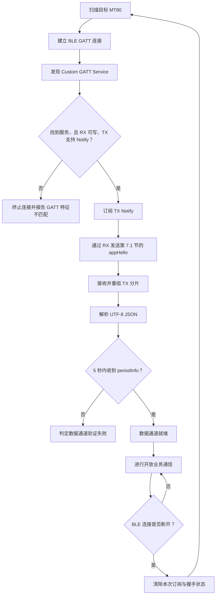

# MT80 BLE GATT 二次开发 SDK

**简体中文** | [English](README.en.md)

    

- 发布方：东莞松山湖不苦科技有限公司（DGSSL BOOKOO TECH LTD.）
- 联系我们：develop@bookoocoffee.com
- 最后更新：2026 年 9 月 2 日
- 最低兼容固件：`v1.2.19.0820`（`releaseVer = 102190820`）

本目录提供 MT80 的 BLE Custom GATT 开放协议和一个最小 Python 接入例程，供第三方在 Windows 10/11 上进行二次开发。

> [!IMPORTANT]
> **支持范围**
>
> 当前示例仅面向 Windows 10/11 和 Python 3.10 或更高版本，ESP32 SDK 示例工程仍在开发中。
>
> **本 SDK 不提供 OTA（设备更新）控制接口。**

> [!WARNING]
> **安全说明**
>
> Custom GATT 通道不要求 BLE 配对、链路加密或额外的应用认证。客户端应核对设备名称和 MAC 地址，确保连接的是预期设备。
>
> **不要通过该通道传输密码、令牌等敏感信息。**

## 1. SDK 内容与能力边界

本目录包含：

|文件|用途|
|---|---|
|`README.zh-CN.md`|中文接入说明和开放协议参考|
|`mt80_gatt_client.py`|最小 GATT 连接、分片、握手和广播观察例程|
|`requirements.txt`|Python 依赖，当前固定为 `bleak==3.0.2`|

开放能力包括：

- 应用层显式握手；
- 连接后的单次广播和 5 Hz 周期广播；
- 常规设置；
- 研磨区间整体读取与整体设置；
- 用户预设的导入、导出、新增、删除、垃圾箱、恢复、编辑、调序和研磨统计；
- 适用于上述业务的通用错误响应。

Python 例程只实现验证数据通道所需的最小协议栈，不封装每个业务接口。业务请求可按照本文给出的 JSON、分片和 GATT 写入规则自行实现。

<br>

## 2. 正在开发的内容

本节中的能力尚未包含在当前 SDK 中，以下信息用于说明开发方向。具体发布时间、接口形式和可用范围以正式发布版本为准。

### 2.1 BLE 研磨启停控制

**当前状态：安全性评估中。**

当前版本暂不提供通过 BLE 远程启动或停止研磨的控制接口。

我们将结合实际使用场景，对操作安全、异常状态处理和防误触机制进行完整评估。确认具备足够安全性后，再在后续版本中尝试开放该接口。

### 2.2 高频传感器数据广播

**计划状态：下一次固件更新。**

为支持具备电动调模开发能力的开发者实现自动控制，我们计划加入专用的高频传感器数据广播。

- 目标广播频率：**10–20 Hz**；
- 主要用途：为电动调模机构提供频率更高的传感器反馈，以支持自动控制。

具体接口形式、数据字段和实际广播频率以正式发布版本为准。

<br>

## 3. Windows Python 快速开始

### 3.1 环境要求

- Windows 10 或 Windows 11；
- 可用的 Bluetooth Low Energy 适配器；
- Python 3.10 或更高版本；
- MT80 固件 `v1.2.19.0820` 或更高版本。

当前例程已使用 Python 3.14.6 验证。

### 3.2 安装与运行

在本目录中执行：

```shell
python -m pip install -r requirements.txt
python mt80_gatt_client.py <MAC>
```

示例：

```shell
python mt80_gatt_client.py 10:20:30:40:50:60
```

脚本会：

1. 在 10 秒内扫描指定的公有 MAC 地址；
2. 连接设备并发现 Custom GATT Service；
3. 订阅 TX Notify；
4. 自动发送应用层显式握手；
5. 重组并解析收到的 UTF-8 JSON；
6. 在 5 秒内等待第一条 `broadcast.periodInfo`，收到后判定数据通道验证成功；
7. 持续显示其他消息，并在交互式终端中原地刷新 `periodInfo`。

终端应支持 ANSI 光标控制并具有足够宽度，避免 JSON 单行自动折行。输出重定向或非交互式终端中，脚本会自动降级为逐块打印。按 `Ctrl+C` 退出并断开连接。

<br>

## 4. BLE 发现与 Custom GATT Service

### 4.1 设备发现

- 设备名称格式为 `BOOKOO MT80 xxxxxxxx`，其中 `xxxxxxxx` 是 8 位十六进制后缀。
- 设备使用 BLE public address；连接时使用扫描结果中的 MAC 地址。
- Custom Service UUID 不包含在 BLE Advertising 数据中。客户端应先按设备名或 MAC 找到设备，连接后再执行 GATT Service Discovery。

本文中的“周期广播”是连接会话内通过 GATT Notify 发送的应用层消息，不是未连接状态下的 BLE Advertising。

### 4.2 UUID 与属性

|用途|UUID|属性|
|---|---|---|
|Custom Service|`4d543830-0001-4b80-8f00-424f4f4b4f4f`|Primary Service|
|RX（客户端 → 设备）|`4d543830-0002-4b80-8f00-424f4f4b4f4f`|Write、Write Without Response|
|TX（设备 → 客户端）|`4d543830-0003-4b80-8f00-424f4f4b4f4f`|Notify|

推荐使用 Write with Response 顺序发送 RX 分片。使用 Write Without Response 时，客户端仍须自行保证分片顺序并遵守平台流控。

### 4.3 连接时序



每次 BLE 断开后，本次订阅和握手状态都失效。**重连后必须重新订阅 TX 并重新发送 `appHello`。**

<br>

## 5. GATT 分片帧 v1

每次 RX Write 或 TX Notify 承载一个分片。帧头固定为 8 字节，所有多字节整数均为小端序。

|偏移|长度|字段|说明|
|---:|---:|---|---|
|0|1|`magic`|固定为 `0xA5`|
|1|1|`version`|固定为 `0x01`|
|2|2|`sequence`|同一条逻辑 JSON 消息的全部分片必须相同|
|4|2|`totalLength`|完整 UTF-8 JSON 的字节数，范围为 `1..4096`|
|6|2|`offset`|本分片 payload 在完整 JSON 中的字节偏移|
|8|N|`payload`|UTF-8 JSON 字节片段|

### 5.1 分片与重组规则

- 第一片的 `offset` 必须为 `0`。
- 后续分片的 `offset` 必须严格等于此前已经接收的 payload 总字节数。
- `offset + 当前 payload 长度 == totalLength` 时，逻辑消息重组完成。
- 接收方只同时重组一条消息。新的 `offset = 0` 分片会开始一条新消息，并替换尚未完成的旧消息。
- 未完成消息在相邻分片间隔超过 2 秒后失效。
- 完整分片包的长度不得超过 `min(协商 ATT MTU - 3, 512)` 字节。
- Python 例程固定使用 20 字节完整分片包，即每片最多携带 12 字节 JSON payload，兼容默认 ATT MTU 23。

`sequence` 只用于确认一条逻辑消息内的分片属于同一组。其值是 `uint16`，不保证跨消息连续；客户端不得用它推断消息丢失、业务顺序，或关联 request 与 response。发送端可以在新消息中复用合法序号。

### 5.2 逻辑消息编码

业务 JSON 必须编码为 UTF-8 后再分片。线上建议发送不含多余空白的紧凑 JSON，例如：

```text
{"request":{"appHello":{"op":"handshake"}}}
```

字段长度限制均按 UTF-8 字节数计算，不是按 Unicode 字符数量计算。

<br>

## 6. JSON 消息模型

### 6.1 顶层消息类型

|顶层字段|方向|说明|
|---|---|---|
|`request`|客户端 → 设备|客户端主动发起的业务请求|
|`response`|设备 → 客户端|请求的成功或失败结果|
|`broadcast`|设备 → 客户端|设备主动发送的单次或周期数据|

组合规则：

- 一个 `request` 节点下只允许出现一个业务对象，例如 `appHello`、`geneSetting`、`grindSection`、`grindPreset` 中的一种。
- 一个 `broadcast` 节点下可以同时出现多个业务对象，例如首次消息同时包含 `baseInfo` 和 `periodInfo`。
- request 同时包含多个业务对象时，设备应返回失败响应，且请求不生效。

### 6.2 成功响应

成功响应位于与请求相同的业务对象下：

```json
{
  "response": {
    "geneSetting": {
      "result": "success",
      "data": {
        "cupDetect": true
      }
    }
  }
}
```

### 6.3 失败响应

```json
{
  "response": {
    "geneSetting": {
      "result": "fail",
      "error": {
        "code": "OUT_OF_RANGE",
        "message": "feedingRpm out of range",
        "field": "feedingRpm"
      }
    }
  }
}
```

同一次请求只返回首个检测到的错误，本次请求整体不生效。`error.field` 仅在错误能定位到具体字段时出现。

<br>

## 7. 握手与设备广播

### 7.1 应用层显式握手

这里的握手不是 BLE 配对或加密握手。客户端完成 TX Notify 订阅后，必须发送：

```json
{
  "request": {
    "appHello": {
      "op": "handshake"
    }
  }
}
```

握手本身没有直接 response。设备收到后发送一次 `baseInfo`，并开始以 **5 Hz（约每 200 ms 一次）** 发送 `periodInfo`。Python 例程以 5 秒内收到第一条 `periodInfo` 作为连接和数据通道验证成功的标准。

### 7.2 连接后单次广播 `baseInfo`

每个连接会话在握手后发送一次。

|字段|类型|含义与约束|
|---|---|---|
|`releaseVer`|int|设备当前发布版本号；例如 `102040416` 表示 `v1.2.4.0416`|
|`snCode`|string|设备 SN，最大 32 个 UTF-8 字节|
|`wifiName`|string 或 null|已连接的 Wi-Fi 名称，最大 32 个 UTF-8 字节；未连接时为 JSON `null`|

```json
{
  "broadcast": {
    "baseInfo": {
      "releaseVer": 102040416,
      "snCode": "SN0000000MT12355",
      "wifiName": "BK-WIFI"
    }
  }
}
```

### 7.3 周期广播 `periodInfo`

握手完成后，设备在 BLE 连接保持期间以 5 Hz 发送该消息。

|字段|类型|含义与约束|
|---|---|---|
|`feedingRpm`|int|下豆速度，单位 rpm|
|`bladeGap`|int|研磨度/刀盘间距，单位 μm|
|`grindRpm`|int|研磨转速，单位 rpm|
|`humidity`|int|相对湿度，单位 %|
|`devState`|string|设备运行状态，见 [7.3.1](#731-devstate)|
|`netState`|string|Wi-Fi 网络状态，见 [7.3.2](#732-netstate)|
|`totalGrinds`|int|设备累计研磨次数|
|`cupDetect`|bool|是否启用放杯检测|
|`autoStop`|bool|是否启用自动停止研磨|
|`fastClean`|bool|是否启用加速清粉|
|`brightness`|int|背光亮度，范围 `[1, 5]`|
|`standbySec`|int|休眠时间，单位秒，范围 `[60, 900]`|
|`selectPreset`|int|当前模式；`-1` 表示 N 档，`[0, 9]` 表示用户预设下标|

```json
{
  "broadcast": {
    "periodInfo": {
      "feedingRpm": 65,
      "bladeGap": 500,
      "grindRpm": 700,
      "humidity": 25,
      "devState": "IDLE",
      "netState": "CONNECTED",
      "totalGrinds": 120,
      "cupDetect": true,
      "autoStop": true,
      "fastClean": true,
      "brightness": 5,
      "standbySec": 60,
      "selectPreset": -1
    }
  }
}
```

#### 7.3.1 `devState`

下列值是稳定的公开枚举：

|值|含义|
|---|---|
|`IDLE`|空闲|
|`GRINDING`|研磨中|
|`SETTING`|设置中|
|`UPDATING`|设备更新中|
|`WARNING`|告警中|
|`HighSpeedClean`|高速清粉中|
|`BootGuide`|开机引导中|
|`UNKNOWN`|未知状态|

客户端必须容忍表中未列出的非空字符串，并按未知状态处理，不应让未知值导致断连或解析整条 `periodInfo` 失败。

> [!IMPORTANT]
>
> 关于公开枚举大小写不统一的问题我们将在下一次固件更新修正这个问题，请务必留意这一点：`devState` 的真值表会在接下来的更新中变化。

#### 7.3.2 `netState`

|值|含义|
|---|---|
|`CONNECTED`|Wi-Fi 已连接|
|`DISCONNECTED`|Wi-Fi 未连接|

<br>

## 8. 常规设置 `geneSetting`

### 8.1 字段定义

|字段|类型|含义与设置范围|
|---|---|---|
|`feedingRpm`|int|下豆速度，单位 rpm，范围 `[10, 65]`|
|`bladeGap`|int|刀盘间距，单位 μm，范围 `[0, 999]`|
|`grindRpm`|int|研磨转速，单位 rpm，范围 `[500, 1500]`|
|`cupDetect`|bool|放杯检测|
|`brightness`|int|背光亮度，范围 `[1, 5]`|
|`standbySec`|int|休眠时间，单位秒，范围 `[60, 900]`|
|`selectPreset`|int|`-1` 表示 N 档，`[0, 9]` 表示用户预设下标|
|`autoStop`|bool|自动停止研磨|
|`fastClean`|bool|加速清粉|

获取和设置都需要客户端主动请求，并以收到对应 response 作为本次业务通信完成的标志。

### 8.2 获取指定字段

`selector.type` 使用 `keys`，`value` 是要读取的字段名数组。

```json
{
  "request": {
    "geneSetting": {
      "op": "get",
      "selector": {
        "type": "keys",
        "value": ["cupDetect"]
      }
    }
  }
}
```

```json
{
  "response": {
    "geneSetting": {
      "result": "success",
      "data": {
        "cupDetect": true
      }
    }
  }
}
```

### 8.3 获取全部字段

```json
{
  "request": {
    "geneSetting": {
      "op": "get",
      "selector": {
        "type": "all"
      }
    }
  }
}
```

```json
{
  "response": {
    "geneSetting": {
      "result": "success",
      "data": {
        "feedingRpm": 65,
        "bladeGap": 500,
        "grindRpm": 700,
        "cupDetect": true,
        "brightness": 5,
        "standbySec": 300,
        "selectPreset": -1,
        "autoStop": true,
        "fastClean": true
      }
    }
  }
}
```

### 8.4 设置一个字段

```json
{
  "request": {
    "geneSetting": {
      "op": "set",
      "data": {
        "feedingRpm": 65
      }
    }
  }
}
```

```json
{
  "response": {
    "geneSetting": {
      "result": "success",
      "data": {
        "feedingRpm": 65
      }
    }
  }
}
```

### 8.5 设置多个字段

```json
{
  "request": {
    "geneSetting": {
      "op": "set",
      "data": {
        "feedingRpm": 65,
        "bladeGap": 500,
        "grindRpm": 700,
        "cupDetect": true,
        "brightness": 5,
        "standbySec": 300,
        "selectPreset": 1,
        "autoStop": true,
        "fastClean": true
      }
    }
  }
}
```

```json
{
  "response": {
    "geneSetting": {
      "result": "success",
      "data": {
        "feedingRpm": 65,
        "bladeGap": 500,
        "grindRpm": 700,
        "cupDetect": true,
        "brightness": 5,
        "standbySec": 300,
        "selectPreset": 1,
        "autoStop": true,
        "fastClean": true
      }
    }
  }
}
```

<br>

## 9. 研磨区间 `grindSection`

研磨区间最多 6 个，只支持整体读取和整体设置，不支持单独修改某个区间的名称或范围。

单个区间格式：

|字段|类型|含义与约束|
|---|---|---|
|`name`|string|区间名称，最大 32 个 UTF-8 字节|
|`range`|JSON array|两个整数构成的区间范围；不同区间的上下限不得重合|

### 9.1 获取全部区间

```json
{
  "request": {
    "grindSection": {
      "op": "get",
      "selector": {"type": "all"}
    }
  }
}
```

```json
{
  "response": {
    "grindSection": {
      "result": "success",
      "data": [
        {"name": "xxxx", "range": [100, 200]},
        {"name": "yyyy", "range": [201, 400]},
        {"name": "zzzz", "range": [401, 600]}
      ]
    }
  }
}
```

### 9.2 设置全部区间

```json
{
  "request": {
    "grindSection": {
      "op": "set",
      "data": [
        {"name": "xxxx", "range": [100, 200]},
        {"name": "yyyy", "range": [201, 400]},
        {"name": "zzzz", "range": [401, 600]}
      ]
    }
  }
}
```

```json
{
  "response": {
    "grindSection": {
      "result": "success",
      "data": [
        {"name": "xxxx", "range": [100, 200]},
        {"name": "yyyy", "range": [201, 400]},
        {"name": "zzzz", "range": [401, 600]}
      ]
    }
  }
}
```

<br>

## 10. 用户研磨预设 `grindPreset`

设备最多保存 10 个当前可见的用户预设。预设删除采用垃圾箱（tombstone）语义，删除后可以在设备仍保留该 tombstone 时恢复。

### 10.1 预设字段

```json
{
  "uid": "5f2c8a0b9d6e4f31a7c2b8d4e1f6a903",
  "name": "法压壶",
  "note": "",
  "bladeGap": 350,
  "feedingRpm": 55,
  "grindRpm": 600,
  "totalGrinds": 27,
  "index": 1
}
```

|字段|类型|含义与约束|
|---|---|---|
|`uid`|string|预设唯一标识；固定为 32 个 ASCII 字节，不含连字符，不允许重复|
|`name`|string|预设名称，最大 32 个 UTF-8 字节|
|`note`|string|可选备注，最大 64 个 UTF-8 字节；设备仅在请求解析期间校验，不会缓存或持久化|
|`bladeGap`|int|刀盘间距，范围 `[0, 999]`|
|`feedingRpm`|int|下豆速度，单位 rpm，范围 `[10, 65]`|
|`grindRpm`|int|研磨转速，单位 rpm，范围 `[500, 1500]`|
|`totalGrinds`|int|设备维护的累计研磨次数；客户端不得设置|
|`index`|int|当前排序下标，范围 `[0, 9]`；同一批配置中不允许重复|

> [!IMPORTANT]
> **`note` 不由设备保存**
>
> 设备接受 `note` 仅用于协议兼容和长度校验。该值不会写入预设存储，也不会保留到后续请求；导出、查询以及新增、导入或编辑操作的成功响应中，`note` 均为空字符串 `""`。如应用需要显示备注，请由客户端自行保存，并通过 `uid` 与预设关联。

字段所有权和通用约束：

- 新增和导入时，客户端提供 `uid`、`index`、`name`、`bladeGap`、`feedingRpm`、`grindRpm`；`note` 可选，但设备不会保留。
- 编辑时可写 `name`、`bladeGap`、`feedingRpm`、`grindRpm`；可提交 `note`，但设备不会保留；排序变化应使用调序接口。
- `uid` 和 `index` 由客户端指定和维护；`totalGrinds` 由设备维护。
- 修改已有预设时必须保留原 UID，不得因名称或参数变化重新生成。
- 出现重复 `uid`、重复 `index` 或其他无效字段时，整个请求不生效。

### 10.2 导出全部预设

```json
{
  "request": {
    "grindPreset": {
      "op": "get",
      "selector": {"type": "all"}
    }
  }
}
```

```json
{
  "response": {
    "grindPreset": {
      "result": "success",
      "data": [
        {
          "uid": "5f2c8a0b9d6e4f31a7c2b8d4e1f6a903",
          "name": "法压壶", "note": "",
          "bladeGap": 350, "feedingRpm": 55, "grindRpm": 600,
          "totalGrinds": 27, "index": 0
        },
        {
          "uid": "7a1e4c9d2b6f45c8a0d3e7f9b2c4d615",
          "name": "手冲", "note": "",
          "bladeGap": 520, "feedingRpm": 48, "grindRpm": 720,
          "totalGrinds": 14, "index": 1
        }
      ]
    }
  }
}
```

### 10.3 导入全部预设

```json
{
  "request": {
    "grindPreset": {
      "op": "set",
      "data": [
        {
          "uid": "5f2c8a0b9d6e4f31a7c2b8d4e1f6a903",
          "index": 0, "name": "法压壶", "note": "",
          "bladeGap": 350, "feedingRpm": 55, "grindRpm": 600
        },
        {
          "uid": "7a1e4c9d2b6f45c8a0d3e7f9b2c4d615",
          "index": 1, "name": "手冲", "note": "浅烘焙",
          "bladeGap": 520, "feedingRpm": 48, "grindRpm": 720
        }
      ]
    }
  }
}
```

```json
{
  "response": {
    "grindPreset": {
      "result": "success",
      "data": [
        {
          "uid": "5f2c8a0b9d6e4f31a7c2b8d4e1f6a903",
          "name": "法压壶", "note": "",
          "bladeGap": 350, "feedingRpm": 55, "grindRpm": 600,
          "totalGrinds": 27, "index": 0
        },
        {
          "uid": "7a1e4c9d2b6f45c8a0d3e7f9b2c4d615",
          "name": "手冲", "note": "",
          "bladeGap": 520, "feedingRpm": 48, "grindRpm": 720,
          "totalGrinds": 14, "index": 1
        }
      ]
    }
  }
}
```

### 10.4 新增预设

```json
{
  "request": {
    "grindPreset": {
      "op": "add",
      "data": {
        "uid": "3c8d5a9e1b7246f0a4d9c7e2b1f6358a",
        "index": 2, "name": "意式", "note": "双份浓缩",
        "bladeGap": 180, "feedingRpm": 62, "grindRpm": 1100
      }
    }
  }
}
```

```json
{
  "response": {
    "grindPreset": {
      "result": "success",
      "data": {
        "uid": "3c8d5a9e1b7246f0a4d9c7e2b1f6358a",
        "name": "意式", "note": "",
        "bladeGap": 180, "feedingRpm": 62, "grindRpm": 1100,
        "totalGrinds": 0, "index": 2
      }
    }
  }
}
```

### 10.5 删除预设

删除成功后，目标预设从当前可见列表移除并进入垃圾箱。如果删除的是中间下标，设备会将所有更大下标自动减一并重新排序。

```json
{
  "request": {
    "grindPreset": {
      "op": "delete",
      "selector": {
        "type": "uid",
        "value": "3c8d5a9e1b7246f0a4d9c7e2b1f6358a"
      }
    }
  }
}
```

```json
{
  "response": {
    "grindPreset": {
      "result": "success",
      "data": {
        "uid": "3c8d5a9e1b7246f0a4d9c7e2b1f6358a"
      }
    }
  }
}
```

### 10.6 查询垃圾箱

```json
{
  "request": {
    "grindPreset": {
      "op": "get",
      "selector": {"type": "tombstones"}
    }
  }
}
```

```json
{
  "response": {
    "grindPreset": {
      "result": "success",
      "data": [
        {
          "uid": "3c8d5a9e1b7246f0a4d9c7e2b1f6358a",
          "lastName": "意式",
          "deletedSeq": 12,
          "deletedUtcTime": 1719830400,
          "hasStatSlot": true
        }
      ]
    }
  }
}
```

|字段|类型|含义与约束|
|---|---|---|
|`uid`|string|已删除预设的 32 字节唯一标识|
|`lastName`|string|删除前的名称快照，最大 32 个 UTF-8 字节|
|`deletedSeq`|int|设备递增的删除序号，用于稳定淘汰最早删除项|
|`deletedUtcTime`|int|删除时的 UTC 时间戳；设备时间不可靠时为 `0`|
|`hasStatSlot`|bool|是否仍保留该预设的统计 slot；当前值为 `true` 时表示保留|

### 10.7 恢复已删除预设

`selector.type` 使用 `uid`。`data.index` 可选；省略时恢复到当前列表末尾。

```json
{
  "request": {
    "grindPreset": {
      "op": "restore",
      "selector": {
        "type": "uid",
        "value": "3c8d5a9e1b7246f0a4d9c7e2b1f6358a"
      },
      "data": {"index": 2}
    }
  }
}
```

```json
{
  "response": {
    "grindPreset": {
      "result": "success",
      "data": {
        "uid": "3c8d5a9e1b7246f0a4d9c7e2b1f6358a",
        "name": "意式", "note": "",
        "bladeGap": 180, "feedingRpm": 62, "grindRpm": 1100,
        "totalGrinds": 0, "index": 2
      }
    }
  }
}
```

恢复规则：

- 未携带 `data.index` 且当前可见预设已达到 10 个时，返回 `CONFLICT`，`message` 为 `preset count exceeded`，`field` 为 `data.index`。
- 携带的 `data.index` 不是合法整数下标，或大于当前列表末尾可插入位置时，返回 `INVALID_PARAM`，`message` 为 `index invalid`，`field` 为 `data.index`。
- 恢复成功但调序失败时，返回 `INVALID_STATE`，`message` 为 `reorder restored preset failed`。
- 恢复成功后，该项从垃圾箱移除，并继续沿用原有统计数据。

### 10.8 编辑预设

```json
{
  "request": {
    "grindPreset": {
      "op": "update",
      "selector": {
        "type": "uid",
        "value": "5f2c8a0b9d6e4f31a7c2b8d4e1f6a903"
      },
      "data": {
        "note": "冷萃",
        "bladeGap": 420,
        "feedingRpm": 45,
        "grindRpm": 650
      }
    }
  }
}
```

```json
{
  "response": {
    "grindPreset": {
      "result": "success",
      "data": {
        "uid": "5f2c8a0b9d6e4f31a7c2b8d4e1f6a903",
        "name": "法压壶", "note": "",
        "bladeGap": 420, "feedingRpm": 45, "grindRpm": 650,
        "totalGrinds": 27, "index": 0
      }
    }
  }
}
```

### 10.9 调整预设顺序

```json
{
  "request": {
    "grindPreset": {
      "op": "reorder",
      "data": {
        "uid": "7a1e4c9d2b6f45c8a0d3e7f9b2c4d615",
        "index": 2
      }
    }
  }
}
```

```json
{
  "response": {
    "grindPreset": {
      "result": "success",
      "data": {
        "uid": "7a1e4c9d2b6f45c8a0d3e7f9b2c4d615",
        "index": 2
      }
    }
  }
}
```

### 10.10 UID 推荐生成方式

UID 由客户端在创建预设时生成。推荐算法将两个 FNV-1a 64 位哈希拼接为 32 个小写十六进制字符：

```text
hhhhhhhhhhhhhhhhllllllllllllllll
```

- 前 16 个字符为高 64 位哈希，后 16 个字符为低 64 位哈希。
- UID 是 32 个 ASCII 字节，不含连字符；它的外观类似 UUID，但不遵循 UUID 标准。
- C 字符串输出缓冲区至少需要 33 字节，以容纳末尾 `\0`。
- 配置名称、备注和研磨参数不参与计算。

参与计算的数据：

1. 从设备 ID 中删除所有非十六进制字符；结果恰好为 12 位时转换为 6 个 MAC 字节，否则回退为 6 个 `0x00`。
2. 计算 `time_value = Unix 毫秒时间戳 + seed`，按无符号 64 位回绕后编码为 8 字节小端序。
3. 高、低 64 位分别使用盐值 `BK-GRIND-DEFAULT-H-V1` 和 `BK-GRIND-DEFAULT-L-V1`。
4. 使用 FNV-1a offset basis `14695981039346656037`、prime `1099511628211`；每次乘法只保留低 64 位。
5. 若高低两段同时为 `0`，或同时为 `0xFF`，将低 64 位与 `0x9E3779B97F4A7C15` 异或。

`seed` 推荐取值：

- 单独新增配置：当前设备中的配置数量；
- 批量导入：当前配置数量加本批配置序号；
- 同一毫秒创建多条配置时，每条必须使用不同的 `seed`。

生成后必须与设备当前已有 UID 再做冲突检查；如有冲突，应使用新的时间戳或未使用的 `seed` 重新生成。该 UID 仅用于标识配置，不用于签名、加密或安全认证。

#### 10.10.1 C 语言参考

```c
#include <ctype.h>
#include <inttypes.h>
#include <stddef.h>
#include <stdint.h>
#include <stdio.h>
#include <string.h>

#define FNV1A64_OFFSET UINT64_C(14695981039346656037)
#define FNV1A64_PRIME  UINT64_C(1099511628211)
#define UID_PERTURB    UINT64_C(0x9E3779B97F4A7C15)

static const char UID_SALT_HIGH[] = "BK-GRIND-DEFAULT-H-V1";
static const char UID_SALT_LOW[] = "BK-GRIND-DEFAULT-L-V1";

static uint64_t fnv1a64_update(
    uint64_t hash,
    const uint8_t *data,
    size_t length
) {
    for (size_t index = 0; index < length; ++index) {
        hash ^= data[index];
        hash *= FNV1A64_PRIME;
    }
    return hash;
}

static int hex_value(char character) {
    if (character >= '0' && character <= '9') {
        return character - '0';
    }
    if (character >= 'a' && character <= 'f') {
        return character - 'a' + 10;
    }
    if (character >= 'A' && character <= 'F') {
        return character - 'A' + 10;
    }
    return -1;
}

static void resolve_mac_bytes(
    const char *device_id,
    uint8_t mac_bytes[6]
) {
    char normalized[12];
    size_t length = 0;
    int overflow = 0;

    for (size_t index = 0;
         device_id != NULL && device_id[index] != '\0';
         ++index) {
        unsigned char character = (unsigned char)device_id[index];
        if (!isxdigit(character)) {
            continue;
        }
        if (length >= sizeof(normalized)) {
            overflow = 1;
            break;
        }
        normalized[length++] = (char)character;
    }

    if (overflow || length != sizeof(normalized)) {
        memset(mac_bytes, 0, 6);
        return;
    }

    for (size_t index = 0; index < 6; ++index) {
        int high = hex_value(normalized[index * 2]);
        int low = hex_value(normalized[index * 2 + 1]);
        if (high < 0 || low < 0) {
            memset(mac_bytes, 0, 6);
            return;
        }
        mac_bytes[index] = (uint8_t)((high << 4) | low);
    }
}

static void build_timestamp_bytes(
    uint64_t timestamp_ms,
    uint64_t seed,
    uint8_t timestamp_bytes[8]
) {
    uint64_t value = timestamp_ms + seed;
    for (size_t index = 0; index < 8; ++index) {
        timestamp_bytes[index] = (uint8_t)(value & UINT64_C(0xFF));
        value >>= 8;
    }
}

static uint64_t calculate_uid_hash(
    const char *salt,
    const uint8_t mac_bytes[6],
    const uint8_t timestamp_bytes[8]
) {
    uint64_t hash = FNV1A64_OFFSET;
    hash = fnv1a64_update(hash, (const uint8_t *)salt, strlen(salt));
    hash = fnv1a64_update(hash, mac_bytes, 6);
    hash = fnv1a64_update(hash, timestamp_bytes, 8);
    return hash;
}

void mottor_generate_grinding_uid(
    const char *device_id,
    uint64_t timestamp_ms,
    uint64_t seed,
    char output[33]
) {
    uint8_t mac_bytes[6];
    uint8_t timestamp_bytes[8];
    resolve_mac_bytes(device_id, mac_bytes);
    build_timestamp_bytes(timestamp_ms, seed, timestamp_bytes);

    uint64_t high = calculate_uid_hash(
        UID_SALT_HIGH, mac_bytes, timestamp_bytes
    );
    uint64_t low = calculate_uid_hash(
        UID_SALT_LOW, mac_bytes, timestamp_bytes
    );

    if ((high == UINT64_C(0) && low == UINT64_C(0)) ||
        (high == UINT64_C(0xFF) && low == UINT64_C(0xFF))) {
        low ^= UID_PERTURB;
    }

    (void)snprintf(
        output, 33, "%016" PRIx64 "%016" PRIx64, high, low
    );
}
```

#### 10.10.2 Python 参考

Python 版本显式使用 `MASK64` 截断每次乘法，并在时间戳与 `seed` 相加时模拟 C `uint64_t` 回绕。

```python
from __future__ import annotations

import re

MASK64 = (1 << 64) - 1
FNV1A64_OFFSET = 14695981039346656037
FNV1A64_PRIME = 1099511628211
UID_PERTURB = 0x9E3779B97F4A7C15

UID_SALT_HIGH = b"BK-GRIND-DEFAULT-H-V1"
UID_SALT_LOW = b"BK-GRIND-DEFAULT-L-V1"


def fnv1a64_update(hash_value: int, data: bytes) -> int:
    for byte in data:
        hash_value ^= byte
        hash_value = (hash_value * FNV1A64_PRIME) & MASK64
    return hash_value


def resolve_mac_bytes(device_id: str | None) -> bytes:
    normalized = "".join(
        re.findall(r"[0-9A-Fa-f]", device_id or "")
    )
    if len(normalized) != 12:
        return bytes(6)
    return bytes.fromhex(normalized)


def build_timestamp_bytes(timestamp_ms: int, seed: int) -> bytes:
    if not 0 <= timestamp_ms <= MASK64:
        raise ValueError("timestamp_ms must fit in uint64")
    if not 0 <= seed <= MASK64:
        raise ValueError("seed must fit in uint64")
    value = (timestamp_ms + seed) & MASK64
    return value.to_bytes(8, byteorder="little", signed=False)


def calculate_uid_hash(
    salt: bytes,
    mac_bytes: bytes,
    timestamp_bytes: bytes,
) -> int:
    hash_value = FNV1A64_OFFSET
    hash_value = fnv1a64_update(hash_value, salt)
    hash_value = fnv1a64_update(hash_value, mac_bytes)
    return fnv1a64_update(hash_value, timestamp_bytes)


def mottor_generate_grinding_uid(
    device_id: str | None,
    timestamp_ms: int,
    seed: int,
) -> str:
    mac_bytes = resolve_mac_bytes(device_id)
    timestamp_bytes = build_timestamp_bytes(timestamp_ms, seed)

    high = calculate_uid_hash(
        UID_SALT_HIGH, mac_bytes, timestamp_bytes
    )
    low = calculate_uid_hash(
        UID_SALT_LOW, mac_bytes, timestamp_bytes
    )

    if (high == 0 and low == 0) or (high == 0xFF and low == 0xFF):
        low ^= UID_PERTURB

    return f"{high:016x}{low:016x}"
```

#### 10.10.3 调用示例与测试向量

```c
char uid[33];

mottor_generate_grinding_uid(
    "AA:BB:CC:DD:EE:FF",
    UINT64_C(1788336000000),
    UINT64_C(3),
    uid
);

printf("UID: %s\n", uid);
```

```python
uid = mottor_generate_grinding_uid(
    "AA:BB:CC:DD:EE:FF",
    1788336000000,
    3,
)
print(f"UID: {uid}")
```

两种实现均应输出：

```text
UID: ae8f0ec693f96e37140fc424ab5df303
```

### 10.11 研磨次数统计

统计数据由设备维护，客户端只能读取，不得设置或改写。统计对象格式：

```json
{
  "totalGrinds": 1250,
  "unbucketedGrinds": 5,
  "dailyGrinds": [
    {"epochDay": 19812, "count": 12}
  ],
  "weeklyGrinds": [
    {"epochWeek": 2830, "count": 45}
  ]
}
```

|字段|类型|含义与约束|
|---|---|---|
|`totalGrinds`|int|当前统计对象累计研磨总次数，包括已归桶、未归桶以及已超出当前日/周窗口的历史次数|
|`unbucketedGrinds`|int|时间不可靠期间产生、未归入任何日桶或周桶的次数；已经包含在 `totalGrinds` 中|
|`dailyGrinds`|JSON array|UTC 日桶，最多返回 10 个有效桶|
|`dailyGrinds[].epochDay`|int|`utc_seconds / (24 * 3600)` 的整数日桶编号，从 Unix epoch 起算|
|`dailyGrinds[].count`|int|该 UTC 日桶内的研磨次数|
|`weeklyGrinds`|JSON array|UTC 周桶，最多返回 16 个有效桶|
|`weeklyGrinds[].epochWeek`|int|`utc_seconds / (7 * 24 * 3600)` 的整数周桶编号，从 Unix epoch 起算|
|`weeklyGrinds[].count`|int|该 UTC 周桶内的研磨次数|

统计规则：

- 日桶和周桶分别按 `epochDay`、`epochWeek` 从小到大排序。
- 日桶只是周桶的更细粒度视图，不会再次累加到 `totalGrinds`。
- 时间不可靠时的新研磨次数只进入 `unbucketedGrinds`，以后也不会反向归入某个日桶或周桶。
- 客户端应以设备返回的桶为准，并可按客户端或服务器时间自行过滤过期桶。
- 预设统计以 `uid` 绑定；名称、参数和排序变化不影响该 UID 下的统计。
- 已删除且仍位于垃圾箱中的预设不包含在以下统计查询范围内。

#### 10.11.1 获取 N 档和所有已激活用户预设统计

```json
{
  "request": {
    "grindPreset": {
      "op": "get",
      "selector": {"type": "activeStats"}
    }
  }
}
```

```json
{
  "response": {
    "grindPreset": {
      "result": "success",
      "data": [
        {
          "uid": "00000000000000ff00000000000000ff",
          "index": -1,
          "stats": {
            "totalGrinds": 120,
            "unbucketedGrinds": 2,
            "dailyGrinds": [
              {"epochDay": 19812, "count": 8}
            ],
            "weeklyGrinds": [
              {"epochWeek": 2830, "count": 32}
            ]
          }
        },
        {
          "uid": "5f2c8a0b9d6e4f31a7c2b8d4e1f6a903",
          "index": 0,
          "stats": {
            "totalGrinds": 27,
            "unbucketedGrinds": 1,
            "dailyGrinds": [
              {"epochDay": 19812, "count": 2}
            ],
            "weeklyGrinds": [
              {"epochWeek": 2830, "count": 5}
            ]
          }
        },
        {
          "uid": "7a1e4c9d2b6f45c8a0d3e7f9b2c4d615",
          "index": 1,
          "stats": {
            "totalGrinds": 14,
            "unbucketedGrinds": 0,
            "dailyGrinds": [
              {"epochDay": 19812, "count": 1}
            ],
            "weeklyGrinds": [
              {"epochWeek": 2830, "count": 3}
            ]
          }
        }
      ]
    }
  }
}
```

`data` 最多包含 11 项：N 档固定为 `index = -1`，当前可见用户预设的 `index` 范围为 `[0, 9]`。

#### 10.11.2 获取整个设备的统计

```json
{
  "request": {
    "grindPreset": {
      "op": "get",
      "selector": {"type": "deviceStats"}
    }
  }
}
```

```json
{
  "response": {
    "grindPreset": {
      "result": "success",
      "data": {
        "totalGrinds": 1250,
        "unbucketedGrinds": 5,
        "dailyGrinds": [
          {"epochDay": 19812, "count": 12}
        ],
        "weeklyGrinds": [
          {"epochWeek": 2830, "count": 45}
        ]
      }
    }
  }
}
```

设备维度的 `data` 不包含 `uid` 或 `index`。

#### 10.11.3 获取特定 UID 的用户预设统计

```json
{
  "request": {
    "grindPreset": {
      "op": "get",
      "selector": {
        "type": "uidStats",
        "value": "5f2c8a0b9d6e4f31a7c2b8d4e1f6a903"
      }
    }
  }
}
```

```json
{
  "response": {
    "grindPreset": {
      "result": "success",
      "data": {
        "uid": "5f2c8a0b9d6e4f31a7c2b8d4e1f6a903",
        "index": 0,
        "stats": {
          "totalGrinds": 27,
          "unbucketedGrinds": 1,
          "dailyGrinds": [
            {"epochDay": 19812, "count": 2}
          ],
          "weeklyGrinds": [
            {"epochWeek": 2830, "count": 5}
          ]
        }
      }
    }
  }
}
```

`selector.value` 必须是当前可见用户预设的 UID。不存在的 UID，或只存在于垃圾箱中的 UID，会返回失败响应。

#### 10.11.4 统计查询错误

|错误码|适用场景|
|---|---|
|`MISSING_FIELD`|缺少 `selector`、`selector.type`，或 `uidStats` 缺少 `selector.value`|
|`INVALID_PARAM`|不支持的 selector，或 `selector.value` 不是合法的 32 字节 UID|
|`PRESET_UID_NOT_FOUND`|UID 不存在，或不是当前可见用户预设|
|`INVALID_STATE`|统计存储暂时不可用|

```json
{
  "response": {
    "grindPreset": {
      "result": "fail",
      "error": {
        "code": "PRESET_UID_NOT_FOUND",
        "message": "preset uid not found",
        "field": "selector.value"
      }
    }
  }
}
```

<br>

## 11. 通用错误响应

所有开放业务使用统一失败结构：

|字段|类型|说明|
|---|---|---|
|`result`|string|失败时固定为 `fail`|
|`error.code`|string|供客户端逻辑判断的稳定错误码|
|`error.message`|string|用于日志和调试的简短英文描述|
|`error.field`|string|可选；与具体字段直接相关时返回|

```json
{
  "response": {
    "grindPreset": {
      "result": "fail",
      "error": {
        "code": "PRESET_UID_DUPLICATE",
        "message": "uid duplicated",
        "field": "uid"
      }
    }
  }
}
```

### 11.1 通用错误码

|错误码|含义|典型场景|
|---|---|---|
|`INVALID_PARAM`|参数不合法|字段格式、数组结构、布尔值或整数类型错误|
|`MISSING_FIELD`|缺少必要字段|缺少 `op`、`data`、`selector` 或业务必填字段|
|`OUT_OF_RANGE`|数值超出范围|转速、刀盘间距、亮度或休眠时间超出定义范围|
|`INVALID_STATE`|当前状态不允许操作|设备忙或对应数据暂时不可用|
|`NOT_FOUND`|目标对象不存在|按 UID 操作的目标不存在|
|`CONFLICT`|提交数据冲突|区间重叠、索引冲突或数量达到上限|

### 11.2 业务特殊错误码

|业务|错误码|含义|
|---|---|---|
|常规设置|`GENE_SETTING_KEY_UNSUPPORTED`|请求或设置的配置字段不受支持|
|研磨区间|`GRIND_SECTION_RANGE_OVERLAP`|区间范围重叠|
|研磨区间|`GRIND_SECTION_COUNT_EXCEEDED`|区间数量超过 6 个|
|用户预设|`PRESET_UID_DUPLICATE`|预设 UID 重复|
|用户预设|`PRESET_INDEX_DUPLICATE`|预设 index 重复|
|用户预设|`PRESET_UID_NOT_FOUND`|目标预设不存在或不在当前查询范围|

常规设置错误示例：

```json
{
  "response": {
    "geneSetting": {
      "result": "fail",
      "error": {
        "code": "GENE_SETTING_KEY_UNSUPPORTED",
        "message": "setting key unsupported",
        "field": "selector.value"
      }
    }
  }
}
```

研磨区间错误示例：

```json
{
  "response": {
    "grindSection": {
      "result": "fail",
      "error": {
        "code": "GRIND_SECTION_RANGE_OVERLAP",
        "message": "section range overlapped",
        "field": "data.range"
      }
    }
  }
}
```

用户预设错误示例：

```json
{
  "response": {
    "grindPreset": {
      "result": "fail",
      "error": {
        "code": "PRESET_INDEX_DUPLICATE",
        "message": "preset index duplicated",
        "field": "index"
      }
    }
  }
}
```

<br>

## 12. 版权、许可与解释权

**Copyright © 2024 东莞松山湖不苦科技有限公司（DGSSL BOOKOO TECH LTD.）。**

本目录中的文档和示例代码遵循父仓库的 [MIT License](../LICENSE)。使用、复制、修改、合并、发布或分发相关内容时，应遵守该许可证的条款并保留相应的版权和许可声明。

在适用法律法规允许的范围内，**东莞松山湖不苦科技有限公司（DGSSL BOOKOO TECH LTD.）对本文档所述接口范围、兼容性说明以及未尽事项保留解释权**。若本声明与 MIT License 或适用法律的强制性规定存在冲突，以 MIT License 和适用法律为准。
